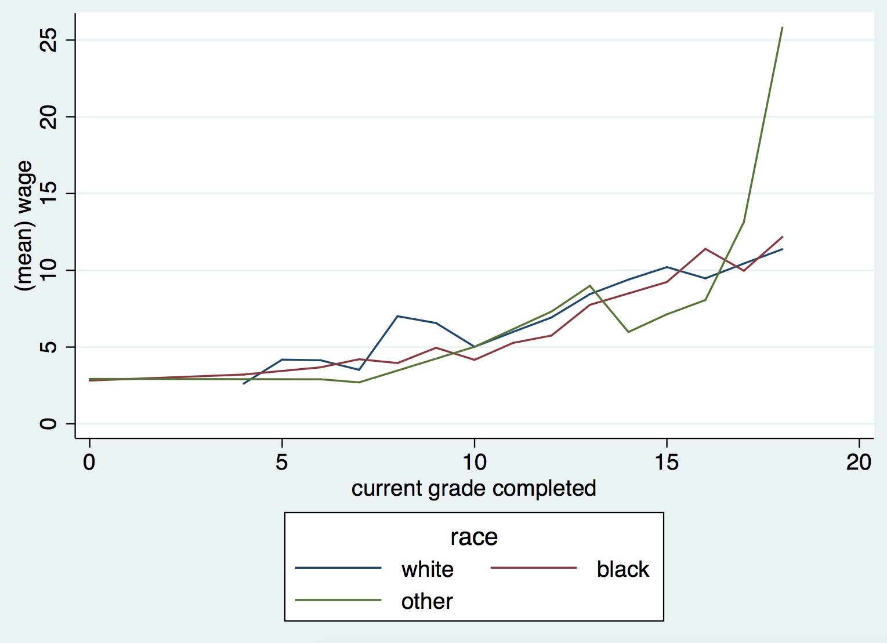
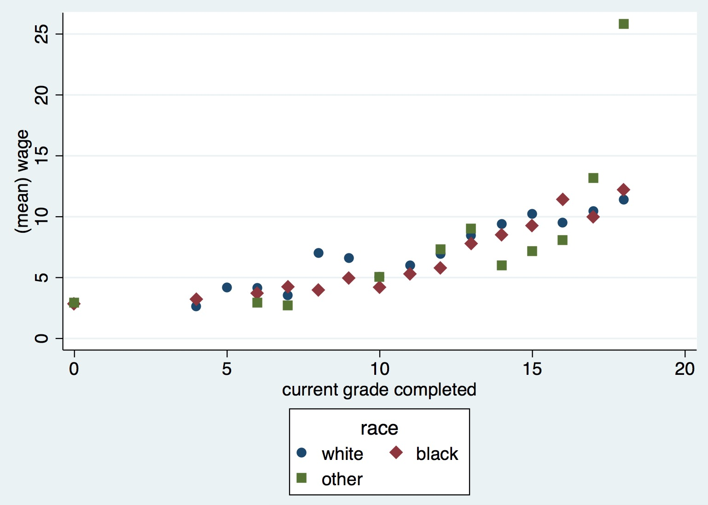

# Stata-bytwoway


## Examples

```
sysuse nlsw88.dta, clear
collapse (mean) wage, by(grade race)
bytwoway line wage grade, by(race)
```



## Aesthetics option

```
collapse (mean) wage, by(grade race)
```

The option aesthetics allow to specify what should change depending on the group. For now, the supported aesthetics are mcolor, lcolor, lpattern, msymbol are supported

```
bytwoway line wage grade, by(race) aes(color lpattern)
```


```
bytwoway (scatter wage grade), by(race) aes(color msymbol)
```



You can specify a particular list for the aesthetics by appending the aesthetic name with an s 
```
bytwoway line wage grade, by(race) aes(color) colors(`""248 118 109" "0 186 56"  "97 156 255""')
```


## Individual options

You can add individual options by enclosing the main command into parenthesis 

```
bytwoway (scatter wage grade, connect(l)), by(race) 

```

## Multiple groups

You can define groups on the fly:

```
sysuse nlsw88.dta, clear
collapse (mean) wage, by(grade smsa race)
bytwoway line wage grade, by(smsa race)
```


## Script

`bytwoway` returns the script  to generate the output

```
return list

. display r(cmd)
macros:
               r(rcm) : twoway (line wage grade in 1/16, mcolor(`"navy"') lcolor(`"navy"') ///

               lpattern(`"solid"') msymbol(`"circle"') legend(label(1 white))) (line wage grade in ///
               17/32, mcolor(`"maroon"') lcolor(`"maroon"') lpattern(`"solid"') msymbol(`"circle"') /// 
               legend(label(2 black))) (line wage grade in 33/43, mcolor(`"forest_green"') ///
               lcolor(`"forest_green"') lpattern(`"solid"') msymbol(`"circle"') ///
               legend(label(3 other))),  legend(subtitle(`"race"'))  
```