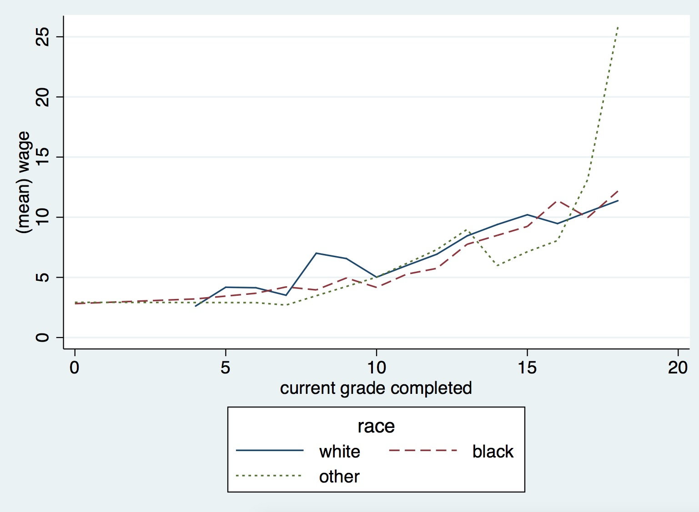
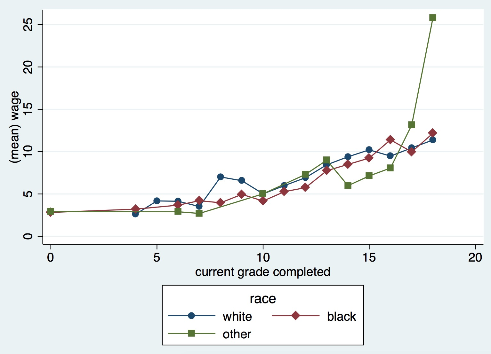
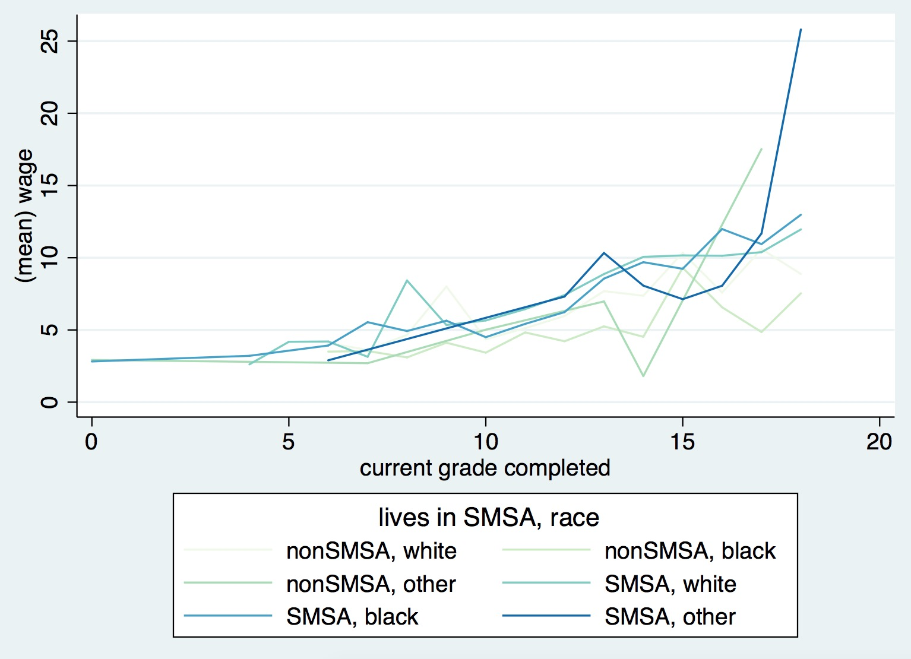
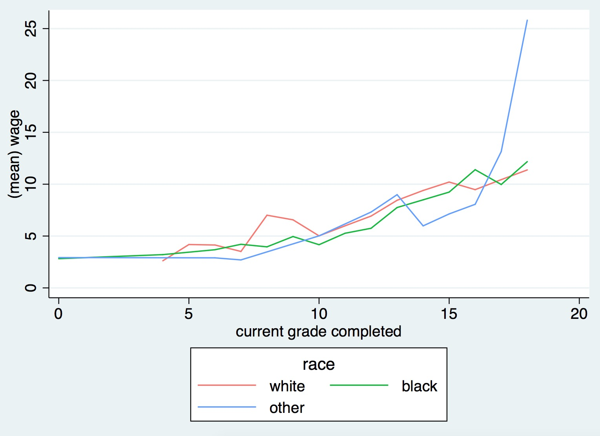
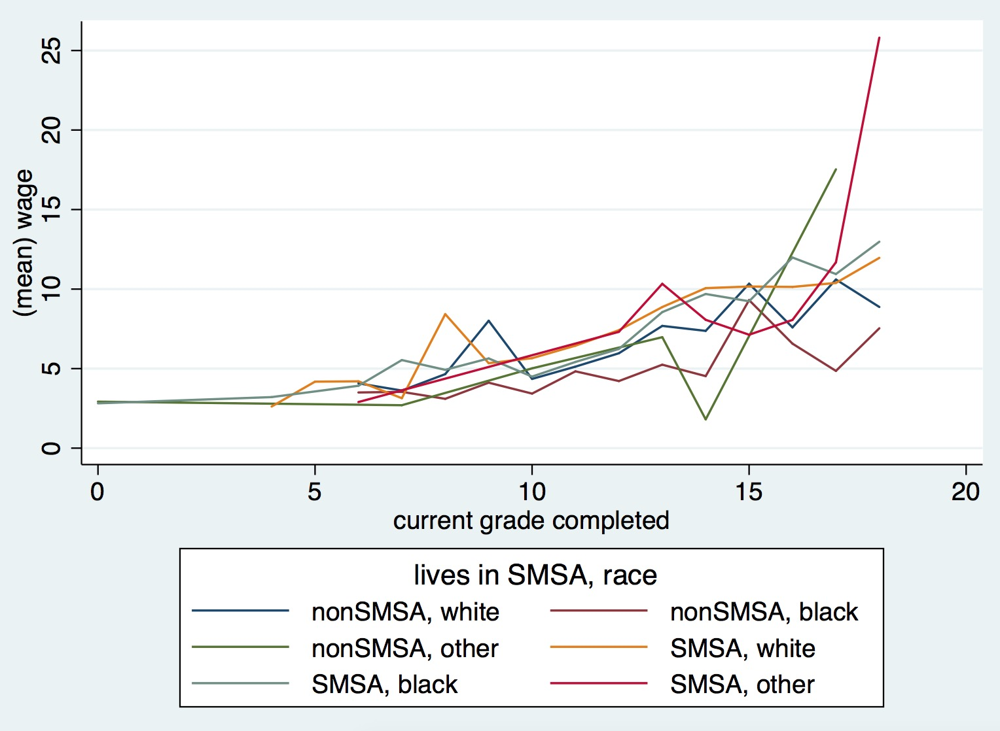

# bytwoway.ado

`bytwoway` is a convenience command to plot graphs *by groups*. The script following `bytwoway` is executed for each group. Colors and patterns can vary accross groups with the `aesthetics` option.


```
sysuse nlsw88.dta, clear
collapse (mean) wage, by(grade race)
bytwoway (line wage grade), by(race) aes(color lpattern)
```



```
bytwoway (scatter wage grade, connect(l)), by(race) aes(color msymbol)
```



```
bytwoway line wage grade, by(smsa race) aes(color) palette(GnBu)
```



To specify the list of values for an aesthetic, append the aesthetic name with an s 
```
bytwoway line wage grade, by(race) aes(color) colors("248 118 109" "0 186 56"  "97 156 255")
```

To change color defaults, you can also use the option `palette` if the package [colorscheme](https://github.com/matthieugomez/stata-colorscheme) is installed.


Define groups on the fly with multiple variables

```
sysuse nlsw88.dta, clear
collapse (mean) wage, by(grade smsa race)
bytwoway line wage grade, by(smsa race)
```



## Script

`bytwoway` returns the macro `r(cmd)` that generates the final graph:

```
macros:
   	r(cmd) : twoway (line wage grade in 1/16, mcolor(`"navy"') lcolor(`"navy"') ///
			lpattern(`"solid"') msymbol(`"circle"') legend(label(1 white))) (line wage grade in ///
			17/32, mcolor(`"maroon"') lcolor(`"maroon"') lpattern(`"solid"') msymbol(`"circle"') /// 
			legend(label(2 black))) (line wage grade in 33/43, mcolor(`"forest_green"') ///
			lcolor(`"forest_green"') lpattern(`"solid"') msymbol(`"circle"') ///
			legend(label(3 other))),  legend(subtitle(`"race"'))  
```

# Installation

```
net install bytwoway, from("https://raw.githubusercontent.com/matthieugomez/bytwoway.ado/master/")
```

If you have a version of Stata < 13, you need to install it manually

1. Click the "Download ZIP" button in the right column to download a zipfile. 
2. Extract it into a folder (e.g. ~/SOMEFOLDER)
3. Run

	```
	cap ado uninstall bytwoway
	net install bytwoway, from("~/SOMEFOLDER")
	```
